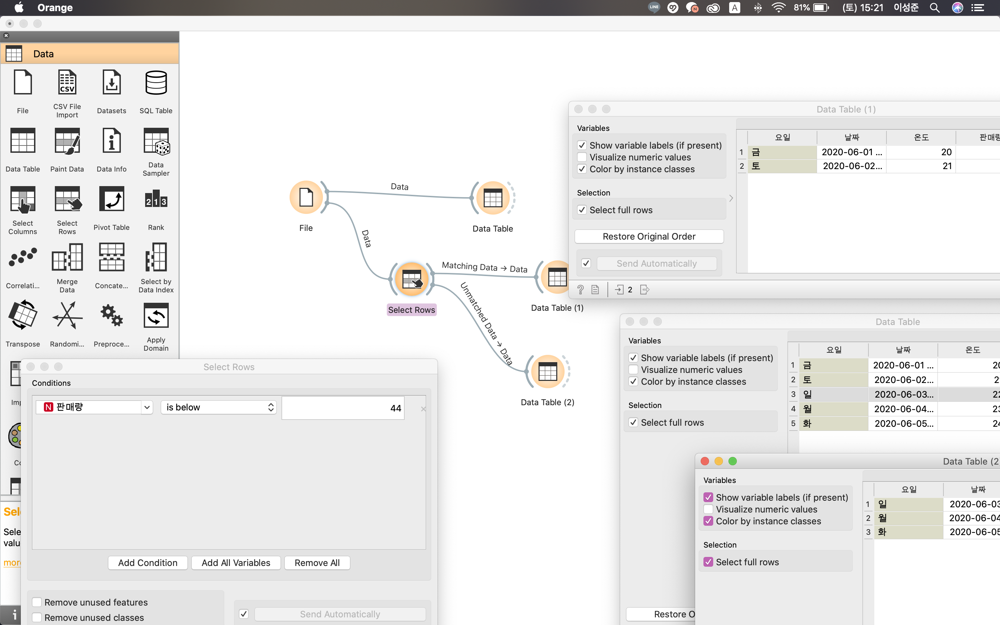
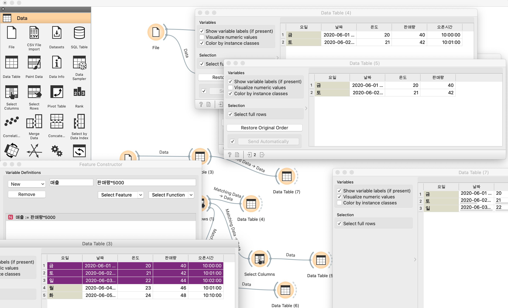

Orange 3
=

### OT
데이터를 정리 한다 -> 표를 사용한다.  
통계 수학을 포함한 머신러닝에 대한 이해를 하게된다.  

오랜지는 도구 이다 !!

***

### 시나리오와 전략

ML 에서 했던 시나리오를 만드는거 다시한번 언급함  
입력 -> 처리 -> 출력  

표, 시각화 (연관성이 있을 때는 그래프), 머신러닝 (미래예측)

***

### 설치 

https://orange.biolab.si/download/#macos  

 
***

### 기본 사용법 

오렌지 가게 ...  
https://docs.google.com/spreadsheets/d/118Nln_zAaFKP8E2fxmqQmEWDmo1goLUzTQrIFS6or1Y/edit#gid=0

필터링....   노션 테이블의 기능들과 크게 다른것은 없는것 같기두...  

***

### 표에 대한 용어들 

표 = 데이터 세트 (data set)  
행 = 개체(instance)  = 관측치 = 기록 = 사례 = 경우  
열 = 특성 = 속성 = 변수 = 필드  

데이터 분야의 도입 출발 !! 이것들에 대한 이해 

