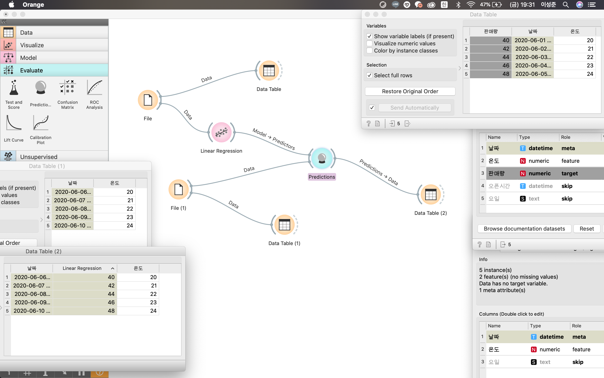

Day Last
=

### 머신러닝 

이 수업은 머신러닝의 모든것을 알고자 하는것이 아니다 !!  

지도학습 - 회귀 (공식을 통하여) 를 알아보자  

공식 -> 모델 이라고 한다. 
모델은 독립변수가 입력되었을때 종속변수를 알수있게 해준다.  

skip 표시 생략  
feature 독립변수  
target 종속변수  

***

### 수업을 마치며

* spreadsheet
    * excel
    * Google Spreadsheet
    * Calc
    * Numbers
* database
    * MySQL
    * ORACLE
    * SQL Server
    * MongoDB

Orange의 장/단점이 GUI 이다 ...?  
GUI 의 경쟁자는 코딩이다.  
오렌지는 내가 할 수 있는것이 아이콘으로 되어있어서 쉽게 사용할 수 있다.  
코딩은 언어적이다 문법을 배워야 하고 배워야 한다 하지만 검색을 통해서 쉽게 배울수 있고 GUI 보다 더 효과적으로 복잡하고 논리적인 흐름을 만들 수 있다.  
오렌지에 아이콘이 1만개라고 생각한다면...? 1만줄의 코딩과의 비교...!  
그렇다면 사용자인 우리가 해야 할 것은 무엇일까? -> 두개의 장점을 합쳐서 환상적인것을 만들어야 한다.  

우리가 자꾸 사용하지 않고 공부만 하는 이유는 무엇인가를 사용하는것이 쉬운것이 아니다.  
그래서 자꾸 공부만 한다.  

하지만 너무 공부하다보면 실제로 사용하는것을 시작하기가 힘들어 질 수 있다.  

천천히 삶에 녹여보자.

끝!