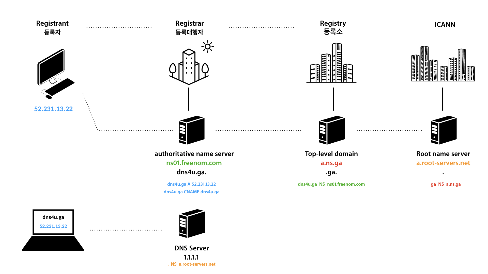
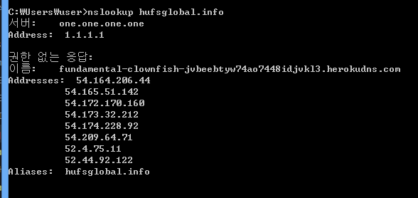
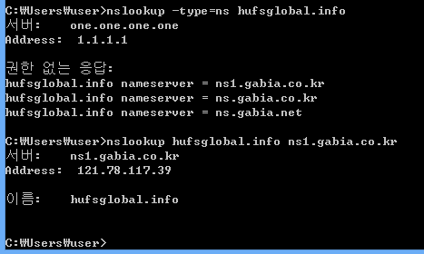

IP 주소 
각 호스트인 컴퓨터들을 연결시켜주는 식별할수있게 해주는것 

처음에는 IP 주소로 다른 컴퓨터에 접속하는것 만으로도 만족했지만, 그 직후 이 IP 주소를 외우는것이 너무 힘들다고 함

Domain Name System - DNS

DNS server ? 
수많은 아이피 주소의 DNS 들이 저장되어있다. 

본인 컴퓨터의 hosts파일을 편집해서 DNS 를 설정하면 우선순위를 가지게 된다

이렇게 호스트파일 조작으로 정보를 빼네는 것을 보통 피싱이라고 한다. 

before...
스탠포드 리서치 인스티듀드 ... 에서 모든 DNS 를 관리? 함

Jon Postel, Paul Mockapetris ..
.... 
원리는 알겠는데 그래서 DNS server 는 어디있지? 누가 관리하지? 그 비용은 누가 내지? 수익금이 발생하나?
... 

public DNS

ISP 를 사용할때 그 통신사의 DNS 서버를 자동으로 사용한다? 

통신사가 제공하는 DNS 서버 ? 그러면 통신사가 다르면 DNS 가 같아도 IP 가 다를수 있나?
아니 다시 
그니까 그 통신사나 회사들이 가지고 있는 DNS 서버가 탐색? 하는 root DNS 서버는 어디지?
흠.... 

DNS internal

DNS server의 역할 
1. 이름과 ip의 등록과 
2. 클라이언트에게 이름에 대한 ip를 알려주는것

DNS server는 전세계에 퍼져 있다. 

도메인의 주소 뒤에는 . 이 생략되어있다. << 특별한 정보를 가지지 안아 생략한다. 
blog.example.com
. > root domain
com > Top-level domain (ex - com, net, io, kr, )
example > Second-level
blog > sub 

각각의 레벨을 담당하는 DNS 서버들이 따로 있다. ( 루트도메인 담당 DNS 서버 , Top-level 담당 DNS 서버)
그리고 각레벨은 아래 레벨의 DNS 서버의 리스트를 알고 있어야 한다. (직속 하위 레벨만)

이 예시의 경우에는 저 sub domain DNS 서버가 IP를 알고있다. 
https%3A%2F%2Fwww.facebook.com%2Fdnssentry40%2Fposts%2Froot-dns%EB%9E%80%EC%B5%9C%EC%83%81%EC%9C%84-dns%EC%9C%BC%EB%A1%9C%EC%8D%A8-%EC%A0%84-%EC%84%B8%EA%B3%84%EC%A0%81%EC%9C%BC%EB%A1%9C-%EC%98%A4%EC%A7%81-13%EB%8C%80%EC%9D%98-%EB%8C%80%ED%98%95%EC%84%9C%EB%B2%84%EB%A1%9C-%EB%AF%B8%EA%B5%AD-10%EB%8C%80-%EC%9D%BC%EB%B3%B8-1%EB%8C%80-%EB%84%A4%EB%8D%9C%EB%9E%80%EB%93%9C-%EB%85%B8%EB%A5%B4%EC%9B%A8%EC%9D%B4%EC%97%90-%EA%B0%81%EA%B0%81-1%EB%8C%80%EC%94%A9%EC%9D%98%EB%8C%80%ED%98%95-%EC%84%9C%EB%B2%84%EB%A1%9C-%2F190179177820203%2F

ICANN - Root name server
Registry 등록소 - Top-level domain
Registrar 등록 대행자 

레코드 타입 > NS, A 등등... 
A : 주소 타입의 레코드

nslookup!

example.com ... 

한번 주소와 대응하는 IP 주소를 알게된다면 캐시를 통해서 IP주소를 저장하게되고 매번 DNS 서버들을 거쳐서 찾지않는다. 
이러한 (캐시) 방법으로 인터넷 서버의 부하를 줄인다. 

ns lookup -type=ns hufsglobal.info
직접 물어보고 싶다면?

My Domain Name

freenom.com
ttl > time to leave? 캐시가 얼마동안 유지되는가

github page custom domain 하려면 github의 ip도 dns 설정에서  A 타입으로 설정해야한다. 

BIND ? DNS 의 첫 서버이자 서비스? 캘리포니아 주립대학? 
집에서 DNS 를 설정? 할때? Dynamic DNS 에 관해서 알아보자  DDNS

HTTPS 와 SSL 무료 인증서에 대해서 찾아보자 ! 